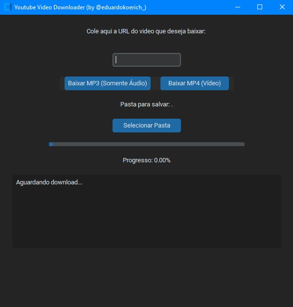
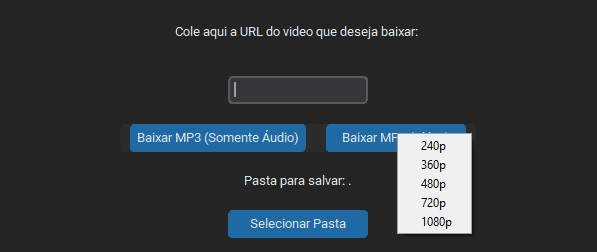
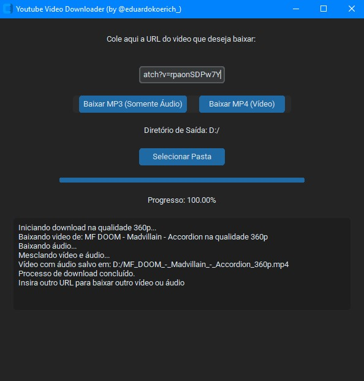

📝 Observações

     *** Este projeto é para fins educacionais e uso pessoal.

    Certifique-se de estar em conformidade com os termos de uso do YouTube. ***
  

🎵 Youtube to MP3 Downloader

    Aplicativo em Python com interface gráfica para baixar vídeos do YouTube no formato MP3 ou MP4

✨ Funcionalidades

    🎧 Download de Áudio: Extrai o áudio de vídeos do YouTube em alta qualidade.

    🎬 Download de Vídeo: Permite baixar vídeos completos do YouTube no formato MP4.

    ⚙️ Seleção de Qualidade de Vídeo: Oferece a opção de escolher a resolução desejada para o download de vídeos MP4 (ex: highest, 720p, 480p, etc.).

    📁 Seleção de Pasta: Permite escolher o diretório de destino para salvar os arquivos MP3 e MP4.

    📊 Barra de Progresso: Exibe visualmente o progresso do download, indicando o quanto já foi baixado.
  
    🖼️ Interface: Desenvolvido com customtkinter.
  
    🔄 Feedback em Tempo Real: Mensagens de status informam o andamento do download.
  
    ⚙️ Execução em Background: O processo de download roda em uma thread separada para evitar travamentos na interface.
  
    🛠️ Conversão para MP3: Utiliza `ffmpeg` para converter o áudio baixado para o formato MP3.

🚀 Como Usar

  [**Clique aqui para baixar o aplicativo (.exe)**](https://github.com/eduardokoerich/Youtube-to-MP3-Downloader/releases/download/v1.1.0/youtube_downloader1.1.rar)

    Execute o arquivo .exe
  
    Cole a URL do vídeo do YouTube no campo indicado.
  
    Selecione o tipo de download: MP3 (apenas áudio) ou MP4 (vídeo completo).
  
    (Se MP4) Escolha a qualidade do vídeo desejada no menu suspenso.
  
    (Opcional) Escolha a pasta onde deseja salvar o arquivo.
  
    Clique em "Download" e aguarde a finalização. A barra de progresso indicará o andamento.

📦 Dependências

    - customtkinter
    - pytubefix
    - ffmpeg 

